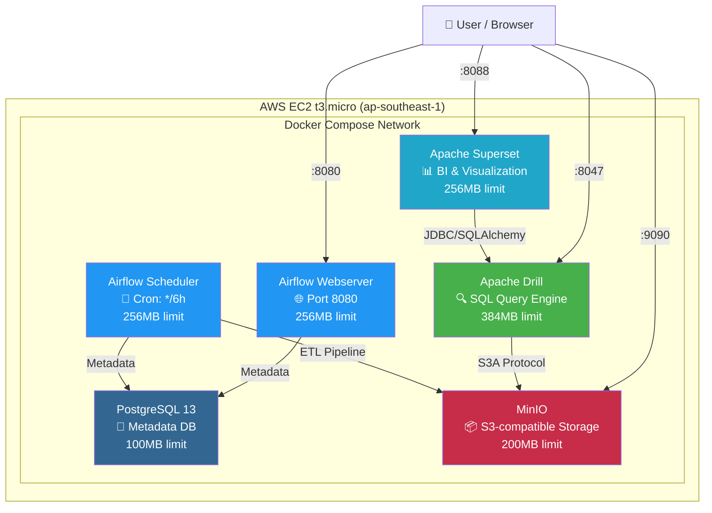
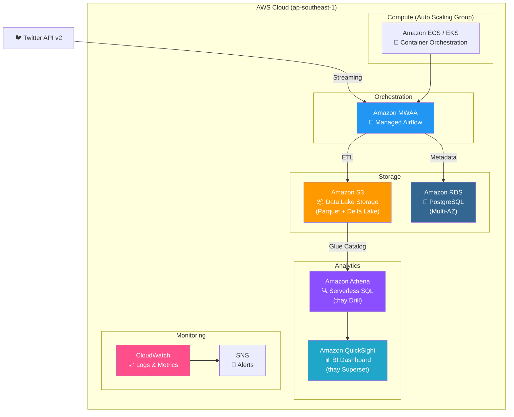
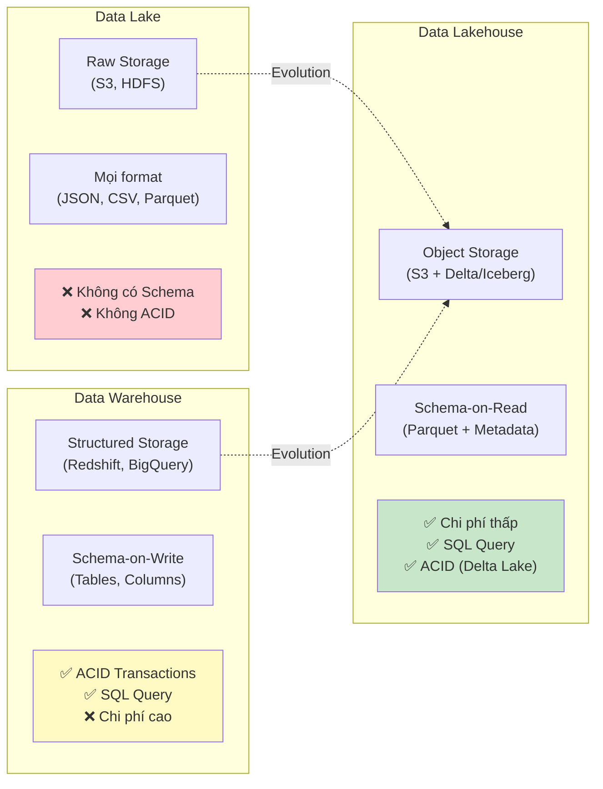
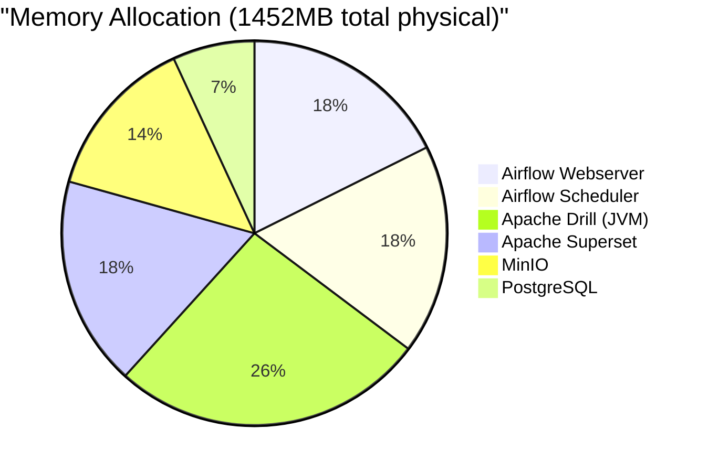

# 🏗️ Kiến trúc Hệ thống — Twitter Data Lakehouse

## 1. Tổng quan

Dự án xây dựng một **Data Lakehouse** trên nền tảng đám mây AWS, kết hợp ưu điểm của Data Lake (lưu trữ dữ liệu thô chi phí thấp) và Data Warehouse (truy vấn SQL có cấu trúc). Hệ thống thu thập dữ liệu Twitter, lưu trữ dưới dạng Parquet/CSV trên object storage S3-compatible, và cung cấp khả năng truy vấn SQL + trực quan hóa.

---

## 2. Kiến trúc Triển khai Hiện tại (Development)

> **Môi trường**: AWS EC2 t3.micro (1 vCPU, 1GB RAM, 4GB Swap)
> **Orchestration**: Docker Compose (6 microservices)

### Data Flow (Luồng dữ liệu)

```mermaid
flowchart LR
    A["🐦 Twitter Data<br/>(Mock Generator)"] -->|"Generate<br/>20 tweets/batch"| B["🔄 Airflow ETL<br/>(Python Task)"]
    B -->|"Clean & Flatten"| C["📝 CSV + JSON<br/>(In-memory buffer)"]
    C -->|"boto3 upload"| D["📦 MinIO Bucket<br/>(twitter-data/)"]
    D -->|"S3A read"| E["🔍 Apache Drill<br/>(SQL Query)"]
    E -->|"SQLAlchemy"| F["📊 Superset<br/>(Dashboard)"]

    style A fill:#1DA1F2,color:#fff
    style B fill:#2196F3,color:#fff
    style D fill:#C72C48,color:#fff
    style E fill:#47B04B,color:#fff
    style F fill:#20A6C9,color:#fff
```

---

## 3. Kiến trúc Production (Đề xuất trên AWS)

> Nếu triển khai production với budget đầy đủ, kiến trúc sẽ sử dụng **managed services** của AWS để đảm bảo scalability, high availability, và giảm operational overhead.

### So sánh Development vs Production

| Thành phần | Development (Hiện tại) | Production (Đề xuất) | Lý do thay đổi |
|------------|----------------------|---------------------|----------------|
| **Storage** | MinIO (self-hosted) | Amazon S3 | 99.999999999% durability, auto-scaling |
| **Metadata DB** | PostgreSQL container | Amazon RDS Multi-AZ | High availability, automated backup |
| **Query Engine** | Apache Drill | Amazon Athena | Serverless, pay-per-query, no infra |
| **BI Tool** | Apache Superset | Amazon QuickSight | Managed, auto-scaling, ML insights |
| **Orchestrator** | Airflow (Docker) | Amazon MWAA | Managed Airflow, auto-scaling workers |
| **Monitoring** | Manual / scripts | CloudWatch + SNS | Automated alerts, log aggregation |
| **Deploy** | Docker Compose | ECS / EKS + Terraform | Auto-scaling, rolling updates |
| **Chi phí** | ~$8/tháng (t3.micro) | ~$50-200/tháng | Trade-off: chi phí vs reliability |

> **Tại sao dùng MinIO thay vì S3 trực tiếp?**
> MinIO cung cấp API **100% tương thích S3** (s3a:// protocol), cho phép phát triển và test cục bộ mà không phát sinh chi phí S3. Khi chuyển sang production, chỉ cần thay đổi endpoint URL — toàn bộ code ETL và Drill config **không cần sửa**.

---

## 4. Data Lakehouse — Khái niệm & So sánh

### Data Lake vs Data Warehouse vs Data Lakehouse

| Tiêu chí | Data Lake | Data Warehouse | **Data Lakehouse** |
|----------|-----------|----------------|-------------------|
| **Storage** | Object Storage (cheap) | Proprietary (expensive) | **Object Storage (cheap)** |
| **Format** | Raw (JSON, CSV) | Structured tables | **Open format (Parquet)** |
| **Schema** | Schema-on-Read | Schema-on-Write | **Schema-on-Read + Enforcement** |
| **ACID** | ❌ | ✅ | **✅ (via Delta Lake/Iceberg)** |
| **SQL Support** | Limited | Full | **Full (Drill, Athena, Spark SQL)** |
| **ML/AI Support** | ✅ | Limited | **✅** |
| **Cost** | Low | High | **Low** |
| **Ví dụ** | S3 + Spark | Redshift, Snowflake | **S3 + Delta Lake + Athena** |

### Lakehouse trong dự án này

Dự án hiện tại triển khai kiến trúc Lakehouse ở mức **foundational**:

- ✅ **Object Storage** (MinIO/S3-compatible) làm storage layer
- ✅ **Open format** (Parquet + CSV) cho data portability
- ✅ **SQL Query Engine** (Apache Drill) cho interactive queries
- ✅ **BI Layer** (Superset) cho visualization
- ✅ **ETL Orchestration** (Airflow) cho data pipeline automation
- ⚠️ **ACID Transactions**: Chưa có Delta Lake/Iceberg (roadmap cho production)

> **Roadmap**: Để đạt full Lakehouse, bước tiếp theo là thêm **Apache Iceberg** hoặc **Delta Lake** table format lên trên Parquet files, cung cấp ACID transactions, time travel, và schema evolution.

---

## 5. Tối ưu hóa cho môi trường Low-Memory

### Memory Budget (1GB RAM + 4GB Swap)

### Các kỹ thuật tối ưu đã áp dụng

| Kỹ thuật | Chi tiết | RAM tiết kiệm |
|----------|----------|----------------|
| **Python Generators** | `yield` thay vì `return list` | O(1) vs O(N) |
| **Loại bỏ Pandas** | Dùng `csv` stdlib | ~80MB |
| **Loại bỏ PyArrow import** | Lazy import, del ngay | ~50MB |
| **Merged Airflow Tasks** | 1 task thay 3, tránh XCom | ~2x serialization |
| **JVM Tuning** | SerialGC, CompressedOops | ~100MB |
| **Postgres Tuning** | shared_buffers=32MB | ~96MB |
| **Docker mem_limit** | Hard cap per container | Prevent OOM cascade |
| **Go GC Tuning** | GOGC=20 cho MinIO | ~50MB |

---

## 6. Security Considerations

| Layer | Hiện tại | Production |
|-------|---------|------------|
| **Network** | Security Group (port-based) | VPC + Private Subnets + NAT |
| **Authentication** | Default passwords | IAM Roles + Secrets Manager |
| **Encryption** | None (HTTP) | TLS/HTTPS + S3 SSE |
| **Access Control** | None | IAM policies + bucket policies |
| **Secrets** | .env file | AWS Secrets Manager / Parameter Store |
